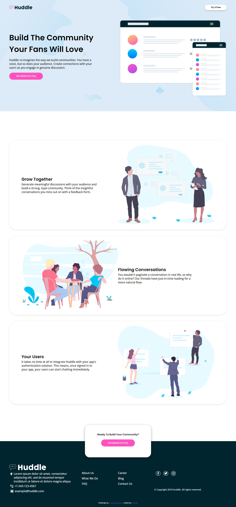

# Frontend Mentor - Huddle landing page with alternating feature blocks solution

This is a solution to the [Huddle landing page with alternating feature blocks challenge on Frontend Mentor](https://www.frontendmentor.io/challenges/huddle-landing-page-with-alternating-feature-blocks-5ca5f5981e82137ec91a5100). Frontend Mentor challenges help you improve your coding skills by building realistic projects. 

## Table of contents

- [Overview](#overview)
  - [The challenge](#the-challenge)
  - [Screenshots](#screenshots)
  - [Links](#links)
- [My process](#my-process)
  - [Built with](#built-with)
  - [What I learned](#what-i-learned)
  - [Continued development](#continued-development)
  - [Useful resources](#useful-resources)

## Overview

### The challenge

Users should be able to:

- View the optimal layout for the site depending on their device's screen size
- See hover states for all interactive elements on the page

### Screenshots

### Links

- Solution URL: [Solution URL](https://github.com/K4UNG/K4UNG.github.io)
- Live Site URL: [Live site URL](https://k4ung1.netlify.app)

## My process

### Built with

- Semantic HTML5 markup
- CSS custom properties
- Flexbox
- CSS Grid

### What I learned

This is my first project from Frontend Mentor and I started this project because I thought I was finally getting comfortable with css. But turns out I still suck at css layouts. I don't use grid quite often but in this project, I had to replace flexbox with grid in most layout places. I didn't even know what I was doing but I kinda guessed what it was and finally it worked out (inefficiently). I'm very much glad that I started this project because now I know what I was missing. Gotta go back to watching tutorials. : )

### Continued development

I also felt like I still need to learn more about responsive layouts. It felt very inefficient while I was doing it(I've only done 2 projects in total to be fair). So yeah, layout tools and responsive design. That's what I'll be focusing on in the coming days.

### Useful resources

- [W3Schools](https://www.w3schools.com) - while I was writing css, I always forget and I always end up at this website whenever this happens.
- [Kevin Powell](https://www.youtube.com/kevinpowell) - This channel is GOLD, not only for this project but also for you entire frontend career. He has so many good tutorials on css so if you feel lost or something, definitely consider checking out this channel.
